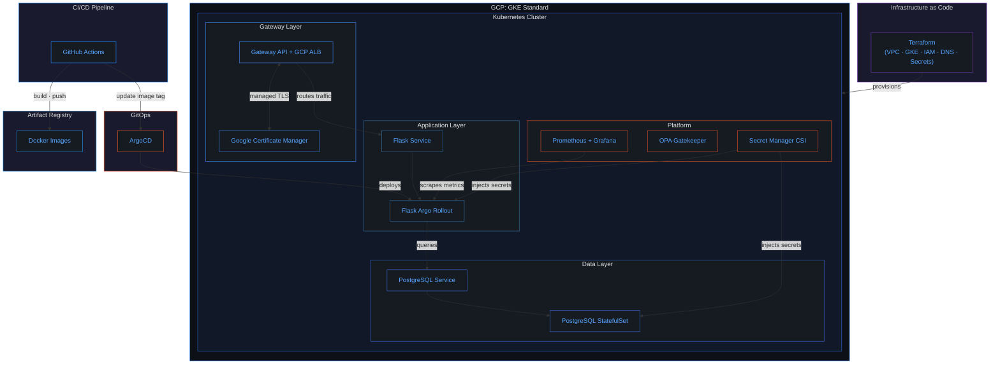
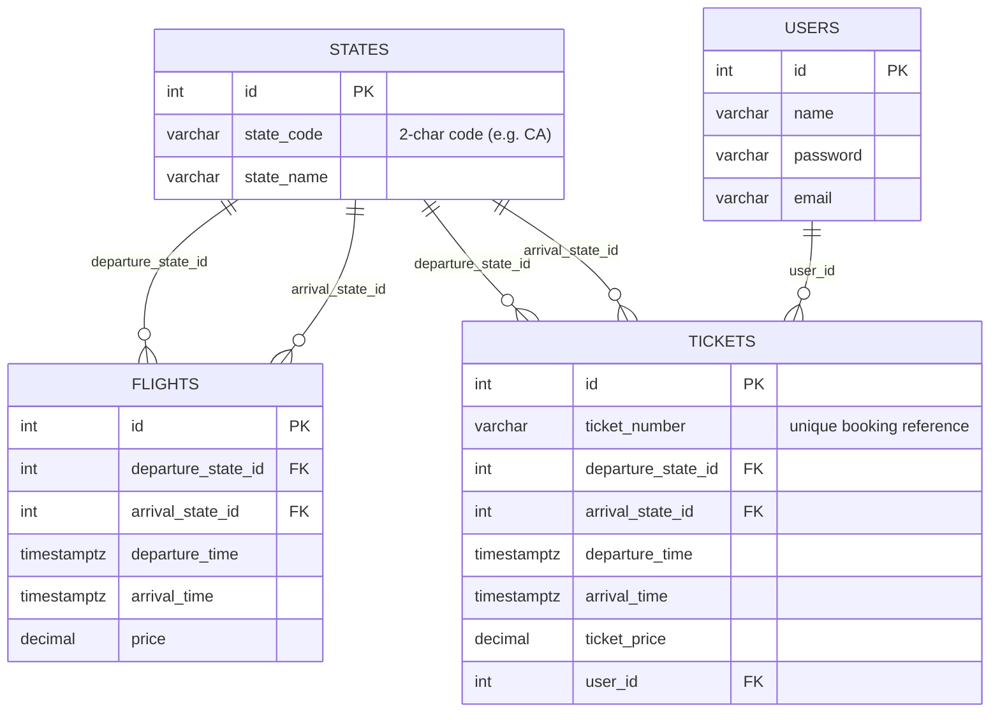

  

<h1 align="center">✈️ FlightOps</h1>

  <strong>A cloud-native flight booking platform built with production-grade infrastructure engineering practices.</strong>

  
  
  
  
  
  
  
  
  

  
  
  

---

## Overview

FlightOps is a Python web application with a PostgreSQL database, deployed on **GKE Standard** with a full **GitOps** pipeline.

The project covers the **entire lifecycle**: application code → Docker → Terraform (GKE) → Kubernetes manifests → ArgoCD (GitOps) → GitHub Actions CI/CD → Prometheus observability → OPA Gatekeeper policy enforcement → Argo Rollouts progressive delivery.

The Flask backend serves a flight booking workflow where users can search flights across US states, view availability, create bookings, and manage their tickets. PostgreSQL runs as an in-cluster StatefulSet, the app is exposed via the **Kubernetes Gateway API** with Google-managed TLS certificates, and secrets are managed through **GCP Secret Manager** with Workload Identity.

---

## Architecture

---

## Tech Stack

| Layer | Technology |
|---|---|
| **Application** | Python, Flask |
| **Database** | PostgreSQL (in-cluster StatefulSet) |
| **DB Admin** | `psql` CLI |
| **Networking** | Kubernetes Gateway API (GKE Gateway Controller) |
| **TLS** | Google Certificate Manager (managed certs) |
| **Containerization** | Docker |
| **Orchestration** | GKE Standard (Kubernetes) |
| **GitOps** | ArgoCD (App of Apps) |
| **Package Management** | Helm |
| **Progressive Delivery** | Argo Rollouts (canary) |
| **Infrastructure as Code** | Terraform (modular) |
| **Cloud Provider** | Google Cloud Platform (GKE) |
| **CI/CD** | GitHub Actions + Workload Identity Federation |
| **Secrets** | GCP Secret Manager + CSI Driver |
| **Observability** | Prometheus + Grafana |
| **Policy** | OPA Gatekeeper |
| **Logging** | GCP Cloud Logging |

---

## Database Schema

The PostgreSQL database contains four tables that model the flight booking domain:

---

## Key Features

- **End-to-end IaC**: Every piece of infrastructure (VPC, GKE cluster, IAM, DNS, Secret Manager) is provisioned via modular Terraform. Zero manual console steps.
- **GKE Standard on GCP**: Managed Kubernetes with Workload Identity, Gateway API, and auto-scaling node pools.
- **GitOps with ArgoCD**: App of Apps pattern, Git is the single source of truth. ArgoCD auto-syncs and self-heals.
- **Gateway API + managed TLS**: Kubernetes Gateway API with GKE-native Gateway Controller and Google-managed certificates.
- **GCP Secret Manager**: Secrets injected via CSI Driver with Workload Identity — never stored in etcd or Git.
- **Full observability**: Prometheus + Grafana dashboards for cluster, app, and database metrics.
- **Policy enforcement**: OPA Gatekeeper enforces security policies (no privileged containers, required labels, trusted image repos).
- **Progressive delivery**: Argo Rollouts with canary deployments — gradual traffic shifting with automated rollback.
- **In-cluster PostgreSQL**: Database runs as a Kubernetes StatefulSet with persistent volumes; administration via `psql` CLI.
- **Flight booking workflow**: Search flights across US states, view availability, book tickets, and manage user accounts.

---