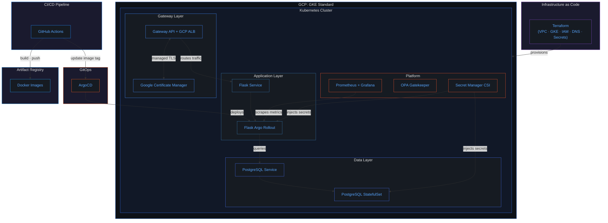
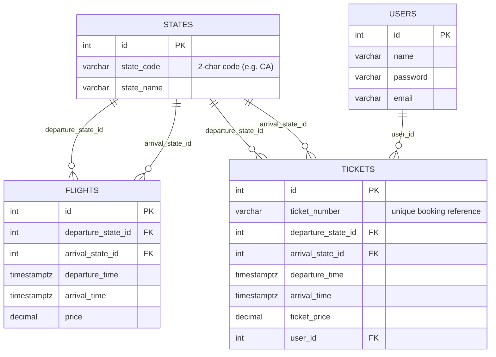

<h1 align="center">FlightOps</h1>

<p align="center">
  A flight booking platform running on Google Kubernetes Engine with GitOps and progressive delivery.
</p>

<p align="center">
  <a href="#"></a>
  <a href="#"></a>
  <a href="#"></a>
  <a href="#"></a>
  <a href="#"></a>
  <a href="#"></a>
  <a href="#"></a>
  <a href="#"></a>
  <a href="#"></a>
</p>

<p align="center">
  <a href="./LICENSE"></a>
  <a href="#"></a>
  <a href="#"></a>
</p>

## Overview

FlightOps is a flight booking web application built with Python (Flask) and PostgreSQL, configured for deployment on Google Kubernetes Engine (GKE).

The application allows users to register accounts, search flights between US states, view availability, book tickets, and manage existing reservations. The repository covers the full delivery workflow: containerizing the service, managing infrastructure with Terraform, defining Kubernetes manifests, and managing deployments with ArgoCD.

> **Project status**: The core Flask application, database migrations, local Docker Compose setup, and PostgreSQL Kubernetes manifests are implemented. Cluster infrastructure (Terraform), GitOps configuration (ArgoCD), and monitoring integrations are actively being developed.

## Architecture

The target architecture uses Google Cloud Platform services alongside Kubernetes-native tooling:


```mermaid
graph TB
    subgraph CI_CD ["CI/CD Pipeline"]
        GHA["GitHub Actions"]
    end

    subgraph Registry ["Artifact Registry"]
        AR["Docker Images"]
    end

    subgraph GitOps ["GitOps"]
        ARGO["ArgoCD"]
    end

    subgraph GCP ["GCP: GKE Standard"]
        subgraph K8S ["Kubernetes Cluster"]
            subgraph Gateway ["Gateway Layer"]
                GW["Gateway API + GCP ALB"]
                GCERT["Google Certificate Manager"]
            end
            subgraph AppLayer ["Application Layer"]
                ROLLOUT["Flask Argo Rollout"]
                SVC["Flask Service"]
            end
            subgraph DataLayer ["Data Layer"]
                PGSVC["PostgreSQL Service"]
                PGSS["PostgreSQL StatefulSet"]
            end
            subgraph Platform ["Platform"]
                PROM["Prometheus + Grafana"]
                OPA["OPA Gatekeeper"]
                SM["Secret Manager CSI"]
            end
        end
    end

    subgraph IaC ["Infrastructure as Code"]
        TF["Terraform<br/>(VPC · GKE · IAM · DNS · Secrets)"]
    end

    GHA -->|"build · push"| AR
    GHA -->|"update image tag"| ARGO
    ARGO -->|"deploys"| ROLLOUT
    GW <-->|"managed TLS"| GCERT
    GW -->|"routes traffic"| SVC
    SVC --> ROLLOUT
    ROLLOUT -->|"queries"| PGSVC
    PGSVC --> PGSS
    TF -->|"provisions"| K8S
    SM -->|"injects secrets"| ROLLOUT
    SM -->|"injects secrets"| PGSS
    PROM -->|"scrapes metrics"| ROLLOUT

    style CI_CD fill:#1a1a2e,stroke:#2088FF,color:#e0e0e0
    style Registry fill:#1a1a2e,stroke:#2496ED,color:#e0e0e0
    style GitOps fill:#1a1a2e,stroke:#EF5B25,color:#e0e0e0
    style GCP fill:#0d1117,stroke:#4285F4,color:#e0e0e0
    style K8S fill:#111827,stroke:#326CE5,color:#e0e0e0
    style Gateway fill:#161b22,stroke:#4285F4,color:#e0e0e0
    style AppLayer fill:#161b22,stroke:#3776AB,color:#e0e0e0
    style DataLayer fill:#161b22,stroke:#4169E1,color:#e0e0e0
    style Platform fill:#161b22,stroke:#E6522C,color:#e0e0e0
    style IaC fill:#1a1a2e,stroke:#7B42BC,color:#e0e0e0
    style GHA fill:#161b22,stroke:#2088FF,color:#58a6ff
    style AR fill:#161b22,stroke:#2496ED,color:#58a6ff
    style ARGO fill:#161b22,stroke:#EF5B25,color:#58a6ff
    style GW fill:#161b22,stroke:#4285F4,color:#58a6ff
    style GCERT fill:#161b22,stroke:#4285F4,color:#58a6ff
    style ROLLOUT fill:#161b22,stroke:#3776AB,color:#58a6ff
    style SVC fill:#161b22,stroke:#3776AB,color:#58a6ff
    style PGSVC fill:#161b22,stroke:#4169E1,color:#58a6ff
    style PGSS fill:#161b22,stroke:#4169E1,color:#58a6ff
    style TF fill:#161b22,stroke:#7B42BC,color:#58a6ff
    style PROM fill:#161b22,stroke:#E6522C,color:#58a6ff
    style OPA fill:#161b22,stroke:#E6522C,color:#58a6ff
    style SM fill:#161b22,stroke:#E6522C,color:#58a6ff
```

## Tech Stack

| Component | Technology |
|---|---|
| Application framework | Python, Flask, Gunicorn |
| Database | PostgreSQL 16 (in-cluster StatefulSet) |
| Database administration | `psql` command-line client |
| Container runtime | Docker (multi-stage build) |
| Kubernetes platform | GKE Standard |
| Traffic routing | Kubernetes Gateway API (GKE Gateway Controller) |
| TLS certificates | Google Certificate Manager |
| Continuous delivery | ArgoCD (App of Apps pattern) |
| Package management | Helm |
| Deployment strategy | Argo Rollouts (canary deployments) |
| Infrastructure as code | Terraform |
| Cloud provider | Google Cloud Platform |
| CI pipeline | GitHub Actions with Workload Identity Federation |
| Secret storage | GCP Secret Manager with CSI Driver |
| Metrics and monitoring | Prometheus, Grafana |
| Policy validation | OPA Gatekeeper |
| Logging | GCP Cloud Logging |

## Database Schema

The database consists of four tables supporting the flight booking workflow:


```mermaid
erDiagram
    STATES {
        int id PK
        varchar state_code "2-char code (e.g. CA)"
        varchar state_name
    }

    FLIGHTS {
        int id PK
        int departure_state_id FK
        int arrival_state_id FK
        timestamptz departure_time
        timestamptz arrival_time
        decimal price
    }

    USERS {
        int id PK
        varchar name
        varchar password
        varchar email
    }

    TICKETS {
        int id PK
        varchar ticket_number "unique booking reference"
        int departure_state_id FK
        int arrival_state_id FK
        timestamptz departure_time
        timestamptz arrival_time
        decimal ticket_price
        int user_id FK
    }

    STATES ||--o{ FLIGHTS : "departure_state_id"
    STATES ||--o{ FLIGHTS : "arrival_state_id"
    STATES ||--o{ TICKETS : "departure_state_id"
    STATES ||--o{ TICKETS : "arrival_state_id"
    USERS ||--o{ TICKETS : "user_id"
```

## Platform Architecture

- GKE Standard cluster provisioned with Terraform, featuring autoscaling node pools and Workload Identity.
- GitOps deployment workflow through ArgoCD using the App of Apps pattern.
- Kubernetes Gateway API paired with Google Cloud Application Load Balancer and managed TLS certificates.
- GCP Secret Manager integration via the CSI driver, keeping credentials out of Git and etcd.
- In-cluster PostgreSQL deployed as a StatefulSet with persistent storage and administered using the `psql` command-line client.
- Progressive delivery with Argo Rollouts for canary deployments and automated rollback.
- Cluster observability via Prometheus and Grafana dashboards, with policy enforcement handled by OPA Gatekeeper.

## Project Structure

```
FlightOps/
├── main.py                     # Flask application entry point
├── Dockerfile                  # Multi-stage production container build
├── compose.postgres.yml        # Local PostgreSQL development container
├── requirements.txt            # Python dependencies
├── pyproject.toml              # Project metadata and tool configuration
├── db/
│   └── migrations/             # SQL schema migrations (001-004)
├── templates/                  # Jinja2 HTML templates
├── static/                     # CSS stylesheets and client assets
├── k8s/
│   ├── postgres/               # PostgreSQL StatefulSet, ConfigMap, PDB, Service, Job
│   └── flask/                  # Flask application manifests (in progress)
├── infra/                      # Terraform modules and environments (planned)
├── gitops/                     # ArgoCD manifests and Helm charts (planned)
└── docs/
    ├── adr/                    # Architecture Decision Records
    └── implementation_plan.md  # 10-day sprint implementation plan
```

## Getting Started

### Prerequisites

| Tool | Version |
|---|---|
| Python | >= 3.12 |
| Docker | Latest stable |
| `kubectl` | Latest stable |
| `terraform` | >= 1.x (for cluster deployment) |
| `gcloud` CLI | Authenticated with GCP account (for cluster deployment) |

### Local Development

1. Copy the sample environment file:
   ```bash
   cp .env.example .env
   ```

2. Start PostgreSQL in Docker:
   ```bash
   docker compose -f compose.postgres.yml up -d
   ```

3. Run the schema migrations:
   ```bash
   for f in db/migrations/*.sql; do
     PGPASSWORD=flightops psql -h localhost -U flightops -d flightops -f "$f"
   done
   ```

4. Install dependencies and start the Flask development server:
   ```bash
   python -m venv .venv
   source .venv/bin/activate
   pip install -r requirements.txt
   python main.py
   ```

5. Open [http://localhost:5000](http://localhost:5000) to view the application.

### Kubernetes Deployment (PostgreSQL)

Apply the PostgreSQL manifests to a running Kubernetes cluster:

```bash
kubectl apply -f k8s/postgres/configmap.yaml
kubectl apply -f k8s/postgres/service.yaml
kubectl apply -f k8s/postgres/statefulset.yaml
kubectl apply -f k8s/postgres/podDisruptionBudget.yaml
kubectl apply -f k8s/postgres/migrationJob.yaml
```

Check the pod status:

```bash
kubectl get pods -l app=postgres
```

## CI/CD Workflow (Planned)

GitHub Actions will drive two automated pipelines:

- Pull request pipeline (`ci.yaml`): Runs linting, tests, container builds, Trivy security scans, and Helm chart validation.
- Deployment pipeline (`cd.yaml`): Builds and publishes images to GCP Artifact Registry, updates image tags in the GitOps repository, and lets ArgoCD synchronize the cluster state.

Authentication to GCP will use Workload Identity Federation instead of long-lived service account keys.

## Architecture Decisions

Technical decisions and trade-offs are documented as Architecture Decision Records in [`docs/adr`](./docs/adr):

| Record | Topic | Status |
|---|---|---|
| [ADR-0000](./docs/adr/0000-use-adr.md) | Record Architecture Decisions | Accepted |
| [ADR-0001](./docs/adr/0001-psql-cli-over-pgadmin.md) | PostgreSQL Developer Tooling and Persistence Strategy (`psql` CLI over pgAdmin) | Accepted |
| ADR-0002 | GKE Standard over self-managed Kubernetes and GKE Autopilot | Planned |
| ADR-0003 | In-cluster PostgreSQL StatefulSet over Cloud SQL | Planned |
| ADR-0004 | GKE Gateway API over Ingress-NGINX | Planned |
| ADR-0005 | Helm for cluster and application packaging | Planned |
| ADR-0006 | Terraform modular structure with remote state | Planned |
| ADR-0007 | ArgoCD GitOps repository structure | Planned |
| ADR-0008 | GCP Secret Manager via CSI Driver over Kubernetes Secrets | Planned |
| ADR-0009 | Argo Rollouts canary deployments for progressive delivery | Planned |

## Implementation Roadmap

The project is tracked against a 10-day implementation sprint detailed in [`docs/implementation_plan.md`](./docs/implementation_plan.md):

- [x] Day 1: Application code, database schema migrations, and Docker containerization
- [x] Day 2: Architecture Decision Records framework and local Docker Compose setup
- [x] Day 3: PostgreSQL Kubernetes manifests (StatefulSet, ConfigMap, Service, PDB, Migration Job)
- [ ] Day 3 (cont.): Flask Kubernetes deployment and service manifests
- [ ] Day 4: Terraform modules for GKE Standard, VPC, and Cloud NAT
- [ ] Day 5: Gateway API setup, HTTPRoute definitions, and Google-managed TLS certificates
- [ ] Day 6: ArgoCD bootstrap and Helm chart packaging
- [ ] Day 7: GitHub Actions CI/CD workflows with Workload Identity Federation
- [ ] Day 8: GCP Secret Manager integration with Secret Store CSI Driver
- [ ] Day 9: Cluster observability with Prometheus, Grafana, and Cloud Logging
- [ ] Day 10: OPA Gatekeeper policy enforcement and Argo Rollouts canary deployment

## Author

**Chetan Thapliyal**: Cloud & DevOps Engineer

<p>
  <a href="https://base.chetan-thapliyal.cloud"></a>
  <a href="https://techtransitions.hashnode.dev"></a>
  <a href="https://www.linkedin.com/in/chetanthapliyal/"></a>
  <a href="https://github.com/ChetanThapliyal"></a>
</p>

## License

This project is licensed under the [MIT License](./LICENSE).