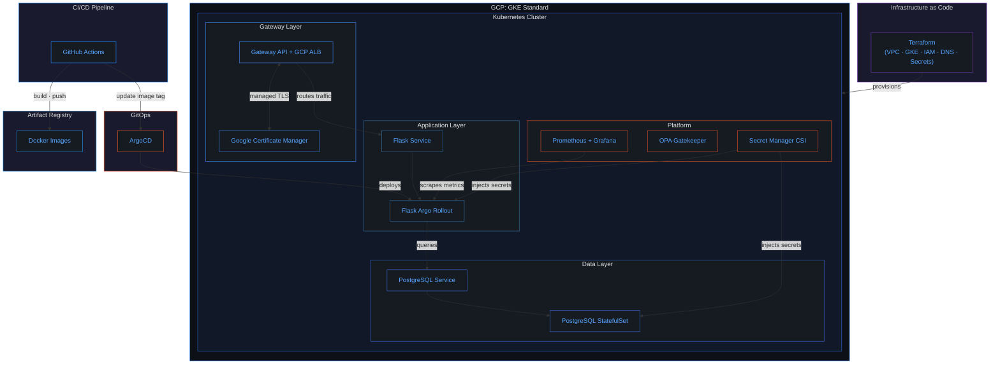
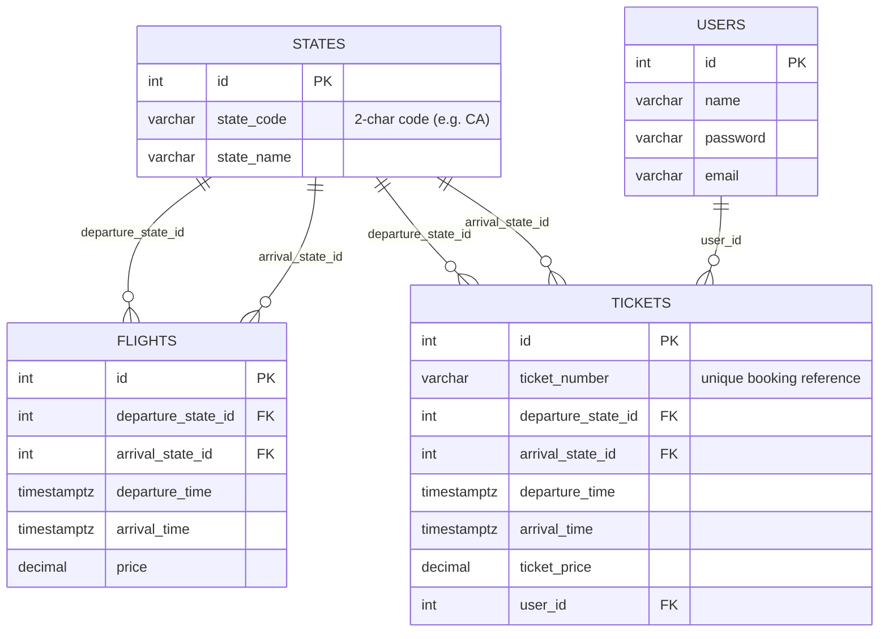
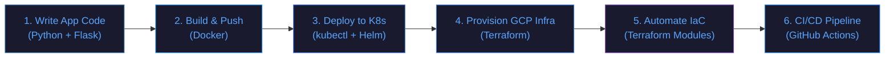

<p align="center">
  
</p>

<h1 align="center">✈️ FlightOps</h1>

<p align="center">
  <strong>A cloud-native flight booking platform built with production-grade infrastructure engineering practices.</strong>
</p>

<p align="center">
  <a href="#"></a>
  <a href="#"></a>
  <a href="#"></a>
  <a href="#"></a>
  <a href="#"></a>
  <a href="#"></a>
  <a href="#"></a>
  <a href="#"></a>
  <a href="#"></a>
</p>

<p align="center">
  <a href="#"></a>
  <a href="#"></a>
  <a href="#"></a>
</p>

---

## Overview

FlightOps is a Python web application with a PostgreSQL database, deployed on **GKE Standard** with a full **GitOps** pipeline. 

The project covers the **entire lifecycle**: application code → Docker → Terraform (GKE) → Kubernetes manifests → ArgoCD (GitOps) → GitHub Actions CI/CD → Prometheus observability → OPA Gatekeeper policy enforcement → Argo Rollouts progressive delivery.

The Flask backend serves a flight booking workflow where users can search flights across US states, view availability, create bookings, and manage their tickets. PostgreSQL runs as an in-cluster StatefulSet, the app is exposed via the **Kubernetes Gateway API** with Google-managed TLS certificates, and secrets are managed through **GCP Secret Manager** with Workload Identity.

---

## Architecture



---

## Tech Stack

| Layer | Technology |
|---|---|
| **Application** | Python, Flask |
| **Database** | PostgreSQL (in-cluster StatefulSet) |
| **DB Admin** | `psql` CLI |
| **Networking** | Kubernetes Gateway API (GKE Gateway Controller) |
| **TLS** | Google Certificate Manager (managed certs) |
| **Containerization** | Docker |
| **Orchestration** | GKE Standard (Kubernetes) |
| **GitOps** | ArgoCD (App of Apps) |
| **Package Management** | Helm |
| **Progressive Delivery** | Argo Rollouts (canary) |
| **Infrastructure as Code** | Terraform (modular) |
| **Cloud Provider** | Google Cloud Platform (GKE) |
| **CI/CD** | GitHub Actions + Workload Identity Federation |
| **Secrets** | GCP Secret Manager + CSI Driver |
| **Observability** | Prometheus + Grafana |
| **Policy** | OPA Gatekeeper |
| **Logging** | GCP Cloud Logging |

---

## Database Schema

The PostgreSQL database contains four tables that model the flight booking domain:



---

## Key Features

- **End-to-end IaC**: Every piece of infrastructure (VPC, GKE cluster, IAM, DNS, Secret Manager) is provisioned via modular Terraform. Zero manual console steps.
- **GKE Standard on GCP**: Managed Kubernetes with Workload Identity, Gateway API, and auto-scaling node pools.
- **GitOps with ArgoCD**: App of Apps pattern, Git is the single source of truth. ArgoCD auto-syncs and self-heals.
- **Gateway API + managed TLS**: Kubernetes Gateway API with GKE-native Gateway Controller and Google-managed certificates.
- **GCP Secret Manager**: Secrets injected via CSI Driver with Workload Identity — never stored in etcd or Git.
- **Full observability**: Prometheus + Grafana dashboards for cluster, app, and database metrics.
- **Policy enforcement**: OPA Gatekeeper enforces security policies (no privileged containers, required labels, trusted image repos).
- **Progressive delivery**: Argo Rollouts with canary deployments — gradual traffic shifting with automated rollback.
- **In-cluster PostgreSQL**: Database runs as a Kubernetes StatefulSet with persistent volumes; administration via `psql` CLI.
- **Flight booking workflow**: Search flights across US states, view availability, book tickets, and manage user accounts.

---

## Implementation Workflow



| Step | Description |
|---|---|
| **1. Application Code** | Write the Flask app with Blueprints, SQLAlchemy models, health endpoints |
| **2. Containerize** | Multi-stage Docker build, push to GCP Artifact Registry |
| **3. GCP Infrastructure** | Provision VPC, GKE cluster, IAM, DNS, and Secret Manager via Terraform modules |
| **4. Kubernetes Manifests** | Flask Deployment, PostgreSQL StatefulSet, Gateway API + HTTPRoute |
| **5. GitOps with ArgoCD** | App of Apps pattern; ArgoCD auto-syncs cluster state from Git |
| **6. CI/CD Pipeline** | GitHub Actions builds and pushes images; updates image tag in `gitops/`; ArgoCD deploys |

---

## Project Structure

```
FlightOps/
├── src/flightops/              # Flask application source
│   ├── routes/                 # Route handlers / Blueprints
│   ├── models/                 # SQLAlchemy models
│   ├── templates/              # Jinja2 templates
│   ├── static/                 # CSS, JS, images
│   └── tests/                  # Unit & integration tests
├── infra/                      # Terraform IaC
│   ├── modules/
│   │   ├── vpc/                # VPC, subnets, Cloud NAT
│   │   ├── gke/                # GKE Standard cluster + node pools
│   │   ├── iam/                # Service accounts, Workload Identity
│   │   ├── artifact-registry/  # Container image repository
│   │   ├── dns/                # Cloud DNS zone + records
│   │   └── secret-manager/     # GCP Secret Manager secrets
│   └── environments/
│       ├── dev/
│       └── prod/
├── k8s/                        # Kubernetes manifests
│   ├── gateway/                # Gateway API + HTTPRoute + TLS
│   ├── app/                    # Flask Deployment + Service
│   └── db/                     # PostgreSQL StatefulSet + Service
├── gitops/                     # ArgoCD GitOps
│   ├── bootstrap/              # Root App of Apps
│   ├── apps/                   # ArgoCD Application manifests
│   └── charts/flightops/       # Helm chart
│       ├── templates/
│       ├── values.yaml
│       ├── values-dev.yaml
│       ├── values-prod.yaml
│       └── Chart.yaml
├── .github/
│   └── workflows/
│       ├── ci.yaml             # Lint · Test · Build · Scan
│       └── cd.yaml             # Build · Push · Update GitOps
├── docs/
│   ├── assets/                 # Images, diagrams
│   └── adr/                    # Architecture Decision Records
├── compose.yml                 # Local dev (PostgreSQL)
├── Dockerfile
└── README.md
```

---

## Getting Started

### Prerequisites

| Tool | Version |
|---|---|
| GCP account | Billing enabled |
| `gcloud` CLI | Authenticated |
| `terraform` | >= 1.x |
| `kubectl` | Latest stable |
| `helm` | >= 3.x |
| `argocd` CLI | Latest stable |
| Docker | Latest stable |

### Local Development

Spin up PostgreSQL locally with Docker Compose for application development:

```bash
cp .env.example .env          # fill in POSTGRES_USER, POSTGRES_PASSWORD, POSTGRES_DB
docker compose up -d          # starts postgres:16 on :5432
```

Connect with `psql`:

```bash
psql -h localhost -U flightops -d flightops
```

### 1. Provision Infrastructure

```bash

cd infra/environments/dev
terraform init
terraform plan
terraform apply
```

### 2. Connect to the Cluster

```bash
gcloud container clusters get-credentials flightops-cluster --region us-central1
kubectl cluster-info
```

### 3. Bootstrap ArgoCD

```bash
kubectl create namespace argocd
kubectl apply -n argocd -f https://raw.githubusercontent.com/argoproj/argo-cd/stable/manifests/install.yaml
kubectl apply -f gitops/bootstrap/root-app.yaml
```

### 4. Verify

```bash
kubectl get pods -n flightops
# Open https://flightops.chetan-thapliyal.cloud
```

---

## CI/CD Pipeline

GitHub Actions drives two workflows:

| Workflow | Trigger | Steps |
|---|---|---|
| **`ci.yaml`** | Every PR | Lint → Test → Build → Trivy scan → Helm lint |
| **`cd.yaml`** | Merge to `main` | Build & push to Artifact Registry → Update image tag in gitops/ → ArgoCD auto-deploys |

CI/CD uses **Workload Identity Federation** — no service account keys. ArgoCD handles the actual deployment via GitOps (CI never touches `kubectl` or `helm install` directly).

---

## Architecture Decisions

Key infrastructure and design decisions are documented as ADRs in [`/docs/adr`](./docs/adr):

| ADR | Decision |
|---|---|
| [ADR-0000](./docs/adr/0000-use-adr.md) | Use Architecture Decision Records |
| [ADR-0001](./docs/adr/0001-gke-standard-over-self-managed-kubernetes.md) | GKE Standard over self-managed Kubernetes and GKE Autopilot |
| [ADR-0002](./docs/adr/0002-in-cluster-postgresql-over-cloud-sql.md) | In-cluster PostgreSQL StatefulSet over Cloud SQL |
| [ADR-0003](./docs/adr/0003-gateway-api-over-nginx-ingress.md) | GKE Gateway API over Nginx Ingress (EOL March 2026) |
| [ADR-0004](./docs/adr/0004-helm-for-cluster-and-app-management.md) | Helm for cluster and application packaging |
| [ADR-0005](./docs/adr/0005-terraform-modular-gcp-infrastructure.md) | Terraform modular design with GCS remote state |
| [ADR-0006](./docs/adr/0006-psql-cli-over-pgadmin.md) | `psql` CLI over pgAdmin for database administration |
| [ADR-0007](./docs/adr/0007-argocd-gitops-with-monorepo.md) | ArgoCD GitOps with App of Apps in a monorepo |
| [ADR-0008](./docs/adr/0008-gcp-secret-manager-over-k8s-secrets.md) | GCP Secret Manager over Kubernetes Secrets |
| [ADR-0009](./docs/adr/0009-argo-rollouts-for-progressive-delivery.md) | Argo Rollouts for canary progressive delivery |

---

## Roadmap

- [ ] Load testing with k6
- [ ] Multi-environment promotion pipeline (dev → staging → prod)
- [ ] Service mesh integration (Istio)
- [ ] Velero for backup and disaster recovery
- [ ] Microservices decomposition (booking service, user service)
- [ ] Message broker (Pub/Sub) + KEDA for event-driven autoscaling

---

## Author

**Chetan Thapliyal**: Cloud & DevOps Engineer

<p>
  <a href="https://base.chetan-thapliyal.cloud"></a>
  <a href="https://techtransitions.hashnode.dev"></a>
  <a href="https://www.linkedin.com/in/chetanthapliyal/"></a>
  <a href="https://github.com/ChetanThapliyal"></a>
</p>

---

## License

This project is licensed under the [MIT License](./LICENSE).
